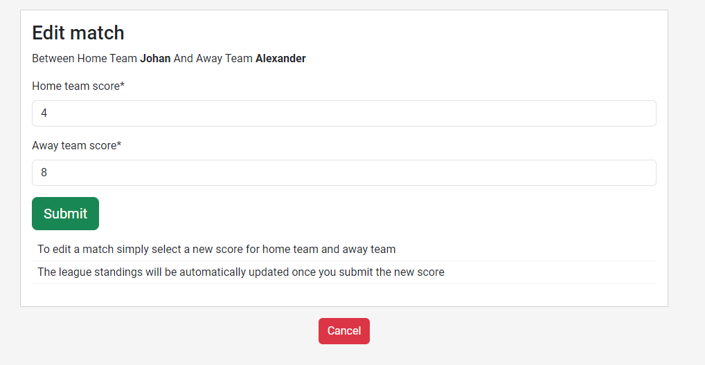

# **League Hub**

League Hub is an user-friendly application where you can create your own league with friends and keep track of scores and standings. Wether it is in football, table-tennis or other games League hub is the place where you can finally solve that long standing issue of who is really the best? 

Create your own league, add matches to it, see all historically added matches for a specific league or in total. This is the place for friendly competition! 

The app is targeted at friends who want a help in keeping track of matches and points for a league, where the application does the counting for you!

Here is a link to the live site - [League Hub](https://league-hub-888548acadce.herokuapp.com/)

## Table of contents

- [League Hub](#league-hub)
- [UX](#ux)
    - [User Stories](#user-stories)
    - [Design](#design)
    - [Wireframes](#wireframes)
- [Agile Development](#agile-development)
- [Data Models and database](#data-models-and-database)
- [Features](#features)
    - [Existing Features](#existing-features)
    - [Future Features](#future-features)
- [Testing](#testing)
- [Manual Testing](#manual-testing)
- [Validator Testing](#validator-testing)
- [Problems and Bugs](#problems-and-bugs)
- [Deployment](#deployment)
- [Technologies, Languages, Frameworks, Libraries, Servers, Programs and Sites used](#technologies-languages-frameworks-libraries-servers-programs-and-sites-used)
- [Credits](#credits)
- [Acknowledgements](#acknowledgements)

## **UX**

### Strategy & Project goal
The strategy and goal for League Hub app is about meeting the user need of providing an user-friendly way of organizing your own league. Where the focus is on making it easy for the user to create and be a part of a league. 

### **Target Audience**
This project is made for those that: 

- Want to have a place to organize a friendly and competetive league in the sport or game of their choosing.
- Want to keep track of score, matches and standings in a league with other users. 

### **User Stories**

The following User Stories were followed to develop the application.

#### - *Account registration*

As a Site User I can register an account so that I can set up my league and be a participant in other leagues

*Acceptance Criteria* 
- User can register an account with an email and a chosen username and password
- The user can log in with chosen username and password
- Visual confirmation is shown when successful registration of account

#### - *Create League*

As a Site user I can create a league so that I can keep track of scores and league standing with other users

*Acceptance Criteria*
- When logged in a user can create their own league
- When logged in a user can customize the league name
- When logged in, a user can select one or multiple users to add to their league

#### - *Search for other users while creating league*

As a site user I can search for other users while creating a league so that I don't have to scroll through a list of all users while creating league

*Acceptance Criteria*

- While logged in and creating a league a user can use a search bar, with autocomplete, to search for other users
- Being able to select users to add as league members from result of search
- Being able to select multiple users directly in the search bar

#### - *View all leagues*

As a Site user I can view a list of all leagues so that I can see my own leagues as well as what other leagues that have been created and choose any league to view in a detailed view

*Acceptance Criteria*

- A user can view a paginated list of all leagues with name and description of league visible
- A user can click on the league to enter a detailed view of the league

#### - *View my leagues*

As a Site user I can view all the leagues that I am a member of so that I can see what leagues I am a member of and choose what league to view in a detailed view

*Acceptance Criteria*

- When logged in a user can view a paginated list of all the leagues that they are a member of
- A user can click on the league to enter a detailed view of the league

#### - *Detailed view of league*

As a Site user I can choose a league to view so that I can see a detailed view of that league and what the score and standings are in that league

*Acceptance Criteria*

- A user can see the standings in the league, with points, games played, won, lost and draw matches visible.
- League members are displayed
- All matches connected to that league are displayed in a paginated list
- When logged in, a user that is a league creator or league member can add matches to the league
- When logged in, a user that is a league creator can edit or delete any match
- When logged in, a user that is a league member can edit or delete their own matches

#### - *View all my matches*

As a Site user I can view all my matches so that see all the matches that I am a part of and the league that they belong to

*Acceptance Criteria*

- When logged in, a user can view all their own matches that they have played and see what league they belong too
- When logged in, a user can view all their own matches and see what date they were added as well as what the score was

#### - *Add matches to league*

As a Site user I can add matches to a league so that the league standings can be updated

*Acceptance Criteria*

- When logged in, a user can add matches with other users to a league that they are a member of
- When logged in, and if the user is a league creator they can add matches for other users that are members of the league they have created

#### - *Modify or delete matches*

As a site user I can modify or delete matches that have been added to a league so that the league standings can be updated

*Acceptance Criteria*

- When logged in, a user can edit the results of already added matches that they a part of.
- When logged in, a user can delete already added matches that they a part of
- When logged in, a user that is a league creator can edit the results of matches for other users that are members of the league they have created
- When logged in, a user that is a league creator can delete matches for other user that are members of the league they have created

#### - *Admin login*

As a Site admin I can login and access the admin dashboard so that I can access the functionalities of a superuser

*Acceptance Criteria*

- Implement a secure login for superuser using Django authentication

#### - *Admin modify or delete leagues*

As a Site admin I can edit and delete created leagues so that I can manage the leagues created on the site

*Acceptance Criteria*

- As a site admin I can edit the description of a league
- As a site admin I can delete a league
- As a site admin I can add matches to a league
- As a site admin I can edit matches
- As a site admin I can delete matches

### **Design**

The site was designed with simplicity in mind, as to not clutter the view for the user and distract from the core functionality. With the use of a consistent color scheme throughout the site. 
The buttons and league standings are presented in a green color, as this is a color usually connected to sports league. The colors were also chosen with a good contrast ratio in mind, to make the site as accessible as possible. 
The font of 'Roboto' was also chosen for its clean and easy to read style. 

#### **Wireframes**

Basic wireframes was produced to have a basic guideline for the design of the site while building it. 

Landing Page

Create League

All Leagues

Detailed League

## **Agile Development**

The application was built using an agile approach, using a Github Project Board and Issues. The Github project board can be found [here](https://github.com/users/MorganStenberg/projects/4). All user stories listed above were created with Github Issues. The user stories were used to keep track of progress throughout the project, via different columns specifying the status of the issue. With columns for 'Todo', 'In progress', 'Done' and 'DoD'. DoD, or Definition of Done was used for user stories that had been implemented and gone through testing. I also added a column for 'Backlog' for future features to be implemented, as a way to keep control of the scope of the project and be sure to deliver a MVP in time.  

## **Data models and database**

Below is and ERD for the custom models produced for the application. Which shows the structure of the PostgreSQL database used in this project. 

Django AllAuth was used for the user model and user authentication system. 

The League model contains all the information on a league. Is connected to the user model both via the fields 'League Creator' and 'League Members'. For League Creator there is a many-to-one relationship to the user model, and for League Members there is a many-to-many relationship. 

The match model contains all the information on matches. The Match model is connected via ForeignKey to the League model, and via ForeignKey to the user model through the fields Home Team and Away Team.  

## **Features**

### **Existing features**

The navbar and footer is the same on all pages, differing only if the user is logged in or out. 

#### Navbar
The navigation bar is located at the top of every page, and contains the logo and links for the user to register or sign in if they are not logged in. The logo is clickable and contains link to the landing page. 

Once logged in the navbar will change to contain links to Dashboard, which leads to the landing page, My leagues and Log out. When on mobile it will collapse to a hamburger icon, below is the navbar when logged in on mobile device. 

#### Footer 

The footer is located at the bottom of every page and contains links to social media, as well as information on who created the site. 

#### Landing page

The landing page welcomes the user and has a call to action for the user to sign up or log in. It also explains the purpose and functionality of the site. 

Once the user is signed up and logged in it changes into a dashboard for the user, with links to all relevant parts of the application. Where the user can easily navigate to view their leagues, create a new league, view all leagues or view all matches.
There is also a message displayed once the user has successfully logged in. 

#### My leagues 

My leagues contains all the leagues the user is a member of. It is paginated by 6 leagues per page. And the leagues are presented with Name and Description for the league. With a link to view the specific league as well. 

Here it is displayed on mobile device/smaller screen. 

#### Detailed League view

This is where the user will interact with their league, or view the standings of a league. Here the user is presented with information as league name, description, league members and ruleset and the standing in the league itself. 

The user can also choose to view all matches connected to that league, by pressing the button for View Matches, which when pressed presents a paginated list of all the matches connected to that league. The matches are sorted by date, with the latest added matches displaying first. Next to the matches are buttons for editing or deleting a match, these will have different colors depending on the role of the user, if the user is the league creator they can edit and delete all matches. If they are a league member they can only edit or delete their own matches. This information is also presented in text to the user. 

If the user is not the league creator and or part of the match and clicks the buttons for editing or deleting a match, a modal will present a message to the user with information that they can only edit or delete their own matches if they are not the league creator. 

There are also messages presented to the user confirming their actions. Messages are presented for successfull adding of match, deleting of match, editing of match. 

#### Add Match 

If the user wants to add a match they press the button for adding a match while in the detailed league view. They are presented with a form for adding a match, where they can choose home team, away team and score for each. The availble choices for home team and away team are filtered for league members, so that only members of the league are available to choose. There is also a role-based permissions here, where they league creator can add matches for all other league members. And league members can only add matches they themselfs are a part of. 

#### Edit Match

If the user have chosen to edit a match they are taken to another page where a form is presented, where only the fields for the scores are available to edit. The same role-based permission is used here where the league creator can edit all other league members matches, but the league member can only edit matches they themself are a part of. Once they are done and have pressed submit they are taken back to the detailed view of the league, where the standings are updated to reflect the changes made. There is also a button to cancel their edit, which takes them back to the detailed view of the league. 

#### Delete Match

If the user chooses to delete a match they are presented with a modal where they have to confirm their choice. Once they confirm the page refreshes and the standings are updated to reflect the changes made. The same role-based permissions are used here, where the league creator can delete matches for all league members and the league members can only delete matches they themself are a part of. 

#### Create League

When the user clicks the button for creating a league, they are taken to a page with a form for creating a league. 

They fields for Name, Description and League members are all required and the form will not be submitted before they are filled in.  

When adding league members the user can search for other users via a search bar with autocomplete, where they can select multiple users and the users they have chosen are visible. 

After submitting the form and creating the league the user is taken to the detailed view of the newly created league, where they are presented with the information regarding the league. As well as information on that they have yet to add any matches to the league. There is also a message confirming the successfully created league. 

#### All Leagues

Provides the user a view of all the leagues created on the site, paginated and in alphabetical order. Presented in the same way as for My Leagues, with buttons for accessing the detailed view of the league. 

#### My Matches 

Provides the user with a paginated view of all the matches they are a part of, of any league. With information on date, teams, score and in what league. Sorted by date, with the latest added match displaying first.

### CRUD 

The user has full CRUD functionality through being able to: 
- Create a league
- Create a match 
- Edit a match
- Delete a match

While the Admin can also delete and update leagues through the admin interface. 

### **Future features**

A list of future features can also be viewed in the Github Projects 'backlog'. A few of these features are ones that I choose to not implement now as to keep the scope of the project viable. 

- Inviting other user to a league & accepting or declining invitations to join a league
- As league creator accepting and declining request from other users to join a league 
- Inviting other users to register an account and join a league
- Email verification
- Time based seasons for a league
- Deleting and archiving a league
- Comment on a league or match
- League managment - when creating a league, being able to choose what ruleset should apply. With differing points for win, draw etc. 

## **Testing**

The site has been tested manually, through validators and through Lighthouse via Google Devtools. As well as being tested in different browsers, Chrome, Edge and Firefox and on Chrome via an mobile android device. 

### **Manual testing**

#### Navbar
| Feature | Action | Expected outcome | Pass/Fail |
| --- | --- | --- | --- |
| logo | hover | change color to black | pass |
| navbar items | hover | change color to black | pass |
| logo | click | redirect to landing page | pass |

When logged in:
| Feature | Action | Expected outcome | Pass/Fail |
| --- | --- | --- | --- |
| navbar - Dashboard | click | Redirect to landing page | pass |
| navbar - My Leagues | click | Open My leagues page | pass |
| navbar Logout item | click | open Log out page | pass |

When logged out:
| Feature | Action | Expected outcome | Pass/Fail |
| --- | --- | --- | --- |
| navbar - Register | click | open Sign Up page | pass |
| navbar - Login | click | open Log in page | pass |

#### Footer
| Feature | Action | Expected outcome | Pass/Fail |
| --- | --- | --- | --- |
| social media icons | click | open social media page in separate tab | pass |

#### Landing page

When logged in:
| Feature | Action | Expected outcome | Pass/Fail |
| --- | --- | --- | --- |
| CTA - View my leagues button | click | open my leagues page | pass |
| CTA - Create league button | click | open create league page | pass |
| CTA - All leagues button | click | open all leagues page | pass |
| CTA - My matches button | click | open my matches page | pass |

When logged out:
| Feature | Action | Expected outcome | Pass/Fail |
| --- | --- | --- | --- |
| CTA - Register button | click | open the sign up page | pass |
| CTA - Log in button | click | open the sign in page | pass |

#### Create league
| Feature | Action | Expected outcome | Pass/Fail |
| --- | --- | --- | --- |
| Submit button | hover | Changes background color to a darker shade of green  | pass |
| Submit button | click | If user input is correct, create a league and open detailead view page of the created league, display a success message of "League created" | pass |
| Submit button | click | If user input is empty or invalid, display error message specifing what field is missing or invalid. For league name validation is used in the model and message appears if characters are used that are not valid | pass |

#### All leagues
| Feature | Action | Expected outcome | Pass/Fail |
| --- | --- | --- | --- |
| view league button | hover | Changes background color to a darker shade of green | pass |
| view league button | click | open page for detailed view of the chosen league | pass |
| pagination button - next | hover | changes background color to a darker shade of red | pass |
| Pagination button - next | click | open the next page of the paginated list of leagues | pass |
| Pagination button - next | click | open the next page of the paginated list of leagues, when there are no more leagues that are paginated to display it disappears | pass |
| Pagination button - previous | click | open the previous page of the paginated list of leagues | pass |

#### My matches
| Feature | Action | Expected outcome | Pass/Fail |
| --- | --- | --- | --- |
| pagination button - next | hover | changes background color to a darker shade of red | pass |
| Pagination button - next | click | open the next page of the paginated list of matches | pass |
| Pagination button - next | click | open the next page of the paginated list of matches, when there are no more matches that are paginated to display it disappears | pass |
| Pagination button - previous | click | open the previous page of the paginated list of matches | pass |

#### My Leagues
| Feature | Action | Expected outcome | Pass/Fail |
| --- | --- | --- | --- |
| view league button | hover | Changes background color to a darker shade of green | pass |
| view league button | click | open page for detailed view of the chosen league | pass |
| pagination button - next | hover | changes background color to a darker shade of red | pass |
| Pagination button - next | click | open the next page of the paginated list of leagues | pass |
| Pagination button - next | click | open the next page of the paginated list of leagues, when there are no more leagues that are paginated to display it disappears | pass |
| Pagination button - previous | click | open the previous page of the paginated list of leagues | pass |

#### Detailed league
| Feature | Action | Expected outcome | Pass/Fail |
| --- | --- | --- | --- |
| view matches button | hover | changes background color to a darker shade of blue | pass |
| view matches button | click | display collapsed list of matches that belong to that league, list is paginated in case of more than 8 matches | pass |
| Pagination button - next | hover | changes background color to a darker shade of red | pass |
| Pagination button - next | click | open the next page of the paginated list of matches | pass |
| Pagination button - previous | click | open the previous page of the paginated list of matches | pass |
| edit match button | hover | Changes background color to a darker shade of green | pass |
| edit match button | click | open page to edit the chosen match | pass |
| delete match button | hover | Changes background color to a darker shade of green | pass |
| delete match button | click | opens modal for user to confirm deletion of match | pass |
| delete match modal - close button | click | closes the modal without deleting match | pass |
| delete match modal - delete button | click | deletes match from league, refreshes the detailed view page of the league and updates the standings | pass |
| delete match modal - error message for user that is not league creator or part of match - close button | click | closes the modal without deleting match | pass |
| edit match modal - error message for user that is not league creator or part of match - close button| click | closes the modal without taking the user to the page for editing the match | pass |
| add match button | hover | changes background color to a darker shade of blue | pass |
| add match button | click | displays a collapsed form for adding a match to the league | pass |
| add match button - for user who is not part of league | click | displays a modal with message saying user may not add matches if not part of league | pass |
| add match modal close button - for user who is not part of league | click | closes the modal without opening add match form | pass |
| Submit button - add match form | hover | Changes background color to a darker shade of green | pass |
| Submit button - add match form | click | if the user input is valid and not empty, add match to league and refreshes page to update standings in league. Form for adding matches collapses again. Displays success message saying that the match was added to the league | pass |
| Submit button - add match form | click | if fields are empty, error message is shown to indicate to user that the fields need to be filled in | pass |
| Submit button - add match form | click | if the user selects the same home team and away team a validation error is raised and an error message is displayed to the user explaining they can't choose the same user for both teams | pass |

#### Edit match
| Feature | Action | Expected outcome | Pass/Fail |
| --- | --- | --- | --- |
| Submit button - edit match form | hover | Changes background color to a darker shade of green | pass |
| Submit button - edit match form | click | if the user input is valid and not empty, the score of the match is updated and the user is redirected back to detailed view of the league. Where the league standings are updated to reflect the change from the edited match| pass |
| Submit button - edit match form | click | if fields are empty, error message is shown to indicate to user that the fields need to be filled in | pass |
| cancel button - edit match form | hover | Changes background color to a darker shade of red | pass |
| cancel button - edit match form | click | redirects user back to page for detailed view of the league that the match belongs to | pass |

#### Sign up
| Feature | Action | Expected outcome | Pass/Fail |
| --- | --- | --- | --- |
| Sign in link | click | Opens sign in page | pass |
| Sign up button | hover | Changes background color to a darker shade of green | pass |
| Sign up button | click | If user input is correct for all fields, create a user and open home page as signed in user. Replacing navbar items for signed in user, and displaying success message saying 'User' Signed in. | pass |
| Sign up button | click | If user input is invalid in any field, display Django Allauth error message until all fields have the correct input | pass |
| Sign in message | click | Success message saying user signed in to disappear once user clicks the X symbol in the corner | pass |

#### Log in 
| Feature | Action | Expected outcome | Pass/Fail |
| --- | --- | --- | --- |
| Sign in link | click | Open sign up page | pass |
| Sign in button | hover | Changes background color to a darker shade of green | pass |
| Sign in button | click | If user input for username and password is correct, open home page as signed in user. Replacing navbar items, displaying success message saying 'User' signed in. | pass |
| Sign in button | click | If user input is empty or invalid in any field, display Django Allauth error message until all fields have the correct input | pass |
| Sign in button | click | If user input is invalid by entering the wrong username or password, display django Allauth error message | pass |
| Sign in message | click | Success message saying user signed in to disappear once user clicks the X symbol in the corner | pass |

#### Log out
| Feature | Action | Expected outcome | Pass/Fail |
| --- | --- | --- | --- |
| Sign out button | hover | Change background color to lighter shade of yellow | pass |
| Sign out button | click | logging out the user, display message saying 'You have signed out', return the user to the landing page and replace navbar items to display 'Register' and 'Login' | pass |
| Signed out message | click | Success message saying user signed out to disappear once user clicks the X symbol in the corner | pass |

### Lighthouse 

The site was tested for performance and accessibility through Google Devtools Lighthouse. 

All pages returned good results for performance and accessibility throughout the site, with performance slightly dipping while testing on mobile device size and on the page for detailed view of the league, but still within acceptable ranges. 

### **Validator testing**

I have validated my HTML, CSS, Javascript and Python code with the websites listed below:

 - HTML: [W3C Markup Validation Service](https://validator.w3.org/#validate_by_input)
 - CSS: [W3C CSS Validation Service](https://jigsaw.w3.org/css-validator/#validate_by_input)
 - Javascript: [JShint](https://jshint.com/)
 - Python [CI Python Linter](https://pep8ci.herokuapp.com/)

JShint and W3C did not return any errors for the Javascript and CSS code.

Python Linter did return errors regarding to long lines and trailing whitespaces, which were taken care of by formatting the code correctly and splitting up lines that
were too long.

The HTML validator did not return any errors, except for the sign up page. Where it seems to have returned false positive for the errors, since when going through the code I can't find the unclosed elements or stray tags that the validator is referring to. Images of the errors and the code is included below. 

CSS Validation

Python Linter

HTML Validation

### **Problems and bugs**

There have not been any major site breaking bugs or problems during the development of this application. But there have been a lot of trial and error, especially when trying to make sure that the views and templates are handling correctly. I have had a lot of use of the detailed error messages, from having debug=True. 

When implementing the 'search bar' for adding users as league members when creating a league, there was quite a lot of issues of getting it working the right way and I tried several different solutions before finally finding Select2, which had what I wanted and was fairly simple to implement. 

During the final testing of the site a few bugs/problems were found: 

- I realised I had no validation for the field of 'Name' for the League model, which caused problems if a user selected a name including special characters as " ! % " etc, causing an error. This was fixed, after a few attempts, by making use of RegexValidator and stating what characters are allowed in the name, this was then tested properly. 

- I also realised that I was not checking for if a user selects the same user for both the home team and away team when adding a match to the league. This was fixed by using a 'cleaning method' and raising a validation error if the user in the fields for home and away team are the same. 

## **Deployment**

The project was deployed to Heroku from Github with following steps: 

**Create the Heroku app** 
1. Log in to Heroku
2. Click on New and select Create new app from the drop-down menu.
3. Enter a unique and appropiate app name.
4. Select you region.
5. Click on "Create App"

**Create the PostgreSQL database using ElephantSQL**
1. Log in to ElephantSQL and navigate to Dashboard.
2. Click on "Create New Instance".
3. Provide a project name and choose "Tiny Turtle", the free plan.
4. Click on "Select Region" and choose Data center.
5. Review all the details and click on "Create Instance".
6. Return to the Dashboard and click on the newly created instance and coyp the database URL.

**Create and prepare files** 
- Create a requirements.txt file
- Create a "Procfile" in the main directiory and add: web: gunicorn 'project-name'.wsgi

- Create and env.py file in the main directory in of your workspace, Gitpod in this case.
- Add the DATABASE_URL and SECRET_KEY to the env.py file

- Update the settings.py file to import the env.py file 
- Add the DATABASE_URL and SECRET_KEY file paths
- Comment out or remove the default database configuration
- Add settings for static files
    - The URL
    - Directory path
    - Rooth path
    - Storage path
    - Default file storage path
- Link the file to the templates directory in Heroku
- Change the templates directory to TEMPLATES_DIR
- Add Heroku to the ALLOWED_HOSTS list  

**Heruko config vars** 
- Add SECRET_KEY value
- Add Database URL 

**Deployment** 
- Before deployment DEBUG in settings.py needs to be set to False
- Connect Heroku to your Github repository
- Either enable automatic deployment or deploy from branch for manual deployment
- View deployed site

**Fork** 
- Navigate to the repository [LeageHub](https://github.com/MorganStenberg/League-hub).
- On the right side of the page, at the top of the repository, select "Fork".
- A copy of the repository is now created.

**Clone** 
- Navigate to the repository [LeageHub](https://github.com/MorganStenberg/League-hub).
- Click on the 'Code' dropdown menu above the list of files and choose a method to copy the URL, via HTTPS, SSH or GitHub CLI.
- Open Terminal, change the current working directory to the desired location of the cloned directory.
- Type 'git clone' and paste the URL copied form GitHub.
- Type 'Enter' to create the local clone.

## **Technologies and Languages used

### Frameworks, Libraries, Servers, Programs and Sites used

## **Credits**

## **Acknowledgements**

I would like to thank my mentor Sandeep Aggarwal for great feedback and support throughout the project. 